# **Code Breaker**

## **Application Overview**

Code Breaker is a terminal-based game where the user is givven a secret code of 4 numbers that are randomly generated from 0-9, and concealed from the player. The player is then given 12 attempts to guess the secret code. If the player succeeds and guesses the code in the 12 attempts they win, if they do not, they lose. Duplicate numbers are allowed, which makes it more difficult for the player.

When creating this game, I really wanted to focus on everything working properly but also with a theme that is in relation to the time of it being made, halloween. I have put text with blood-like font at the end of the game that tells you if you have won or lost, i have also added a pumpkin to the home page, all of this was created by the use of [ASCII.](https://www.asciiart.eu/)

## **Table of Contents:**

1. [**Application Overview**](#application-overview)
1. [**Planning Stages**](#planning-stages)
   - [**Target Audience**](#target-audience)
   - [**User Stories**](#user-stories)
   - [**Application Aims**](#application-aims)
   - [**UX Flow Chart**](#ux-flow-chart)
   - [**Technology Used**](#technology-used)
     - [**_Libraries_**](#libraries)
1. [**Current Features**](#current-features)
   - [**Main Menu**](#main-menu)
     - [**_Main Logo Graphic_**](#main-logo-graphic)
     - [**_Instructions_**](#instructions)
     - [**_Exit Game_**](#exit-game)
   - [**Run Game**](#run-game)
     - [**_Generating the Secret Code_**](#generating-the-secret-code)
   - [**Player Guess Input with Error Handling**](#player-guess-input-with-error-handling)
   - [**Comparing Player Guess to Secret Code**](#comparing-player-guess-to-secret-code)
     - [**_Player Guess Output_**](#player-guess-ouput)
   - [**Game Graphics and Messages**](#game-graphics-and-messages)
     - [**_You Win!_**](#you-win-graphic-and-message)
     - [**_Game Over_**](#game-over-graphic-and-message)
   - [**Play Again Function with Error Handling**](#play-again-function-with-error-handling)
1. [**Considerations for Future Enhancements**](#considerations-for-future-enhancements)
   - [**Difficulty Levels**](#difficulty-levels)
   - [**Story-Based Levels**](#story-based-levels)
   - [**Improved UI**](#improved-ui)
   - [**Accessibility Features**](#accessibility-features)
1. [**Testing**](#testing)
1. [**Deployment**](#deployment)
   - [**Final Deployment (Render)**](#final-deployment-render)
1. [**Credits**](#credits)
   - [**Content**](#content)
   - [**Acknowledgements**](#acknowledgements)

## **Planning Stages**

### **Target Audience**

This game has been created with a wide target audience in mind. Anyone who feels like they would like to test their brain and see if they are able to crack the code are able to test themselves, whether that be a 20+ year old or someone from the younger audience who would like to try and crack it with help from a parent.

### **User Stories**

As a user:

- I would like to play a fun and engaging code breaker game where i need to test myself.
- I wish to clearly see what game I am playing.
- I wish to have the choice to play the game straight from the menu and be able to see the instructions.
- When I have entered my guess, I want to see how many numbers in my guess were correct and in the right position, and how many were correct but in the wrong position, so that I can advance on to my next attempt having an understanding on what ive done so far.
- I want to be reminded of how many attempts I have remaining.
- I wish to be told whether i won the game or lost the game with enjoyable graphics.
- I want to be able to exit the game from the menu if i do not wish to play.

### **Application Aims**

This application aims to:

- Provide a fun and engaging code breaking game that tests the brain of the user.
- Make clear to the player that they are able to play the game, read the instructions and exit the game from the main menu.
- Provide the user with an easy to understand user interface that is clear, and provides easy to understand feedback.
- Run successfully on a loop for as long as the player needs, without crashing due to errors or the players input.

### **UX Flow Chart**

In order to help me visualise the basic logic of how the game will work and for the user to have a smooth experience, I created the following flow chart during the planning stages using [draw.io's flow chart maker](https://app.diagrams.net/):

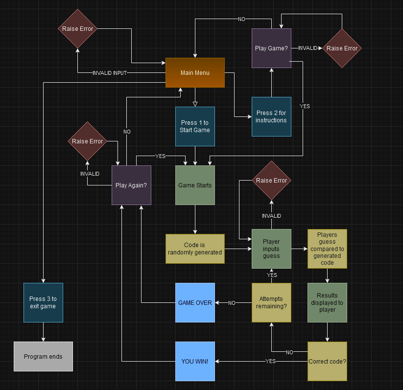

### **Technology Used**

This project has been written entirely in Python.

#### **Libraries**

Two libraries were imported for this code:

**random**:

- random.choice() was utilised in the generate_code() function for the game, and is necessary in order to create a randomly generated code of 4 numbers from 0-9.

## **Current Features**

### **Main Menu with Error Handling**

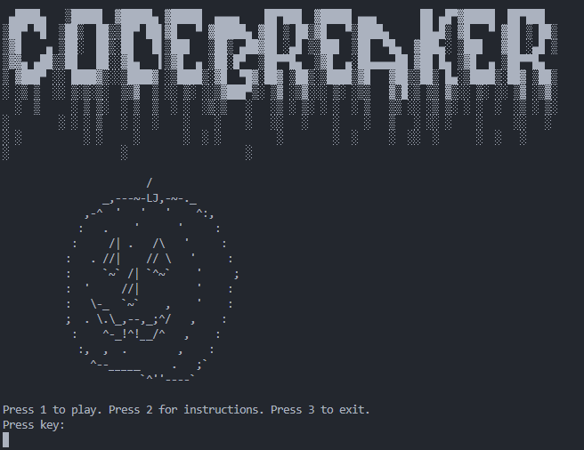

The main menu screen is the first thing the player sees when they start the program. It displays the main logo graphic, and below it provides the user with three options:

In order to progress away from the main menu, the player is required to press one of these three options to take them to their required destination in the program.

As Python automatically converts input into strings, the user input is first converted to an integer using the built-in 'int()' function. The int(input()) function sits within a try statement that assumes there will be no error in the code and directs the player to the appropriate part of the program if they enter 1, 2 or 3. A ValueError is then raised in an except statement for any input that is not a 1, 2 or 3. Shown below is an example of what the program provdes if you enter an invalid number, a letter, a special character and the text version of a number:

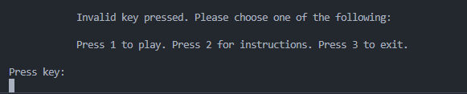

#### **Main Logo Graphic**

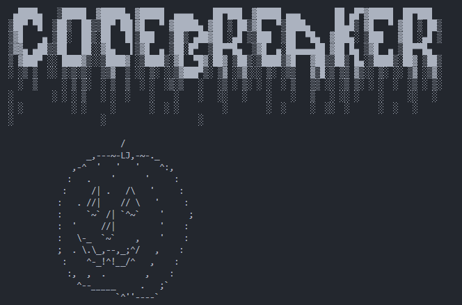

The main logo for this game was decided due to the time of when it was being made, Halloween. I got the pumpkin ASCII art from this website. [ASCII Art](https://www.asciiart.eu/holiday-and-events/halloween). I also used the Text to Ascii Art for all the bloody text that is used. [Text to ASCII Art](https://www.asciiart.eu/text-to-ascii-art)

#### **Instructions**

If the player would like to know the instructions to the game they can simply enter '2' when they are on the main menu screen. Once the player has entered '2' they are given a set of instructions just like this:

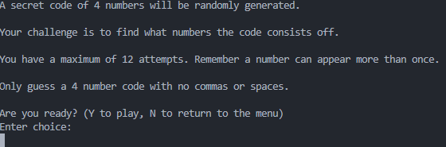

Below the instructions, the player is offered 2 choices. One being 'Y' if he would like to play the game and 'N' if he would like to return to the main menu. If the user enters 'Y' then the start_game() function runs.

#### **Exit Game**

If the player wishes to exit the game from the menu, they can enter '3', and the following text will display before the program will close and no further input can be entered into the terminal:

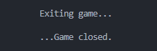

### **Run Game**

When the user either enters '1' from the main menu, or enters 'Y' in the play_again() function, the run_game() function is called and the game begins, the player is then met with the following screen:

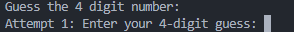

#### **Generating the Secret Code**

The secret code is randomly generated using Python's 'random' library. Two constants have been declared that are crucial for the creation of this random secret code: 'RANDOM_NUMBERS', which declares the range of the numbers that will be randomly generated, and 'CODE_LENGTH' which determines how long the code is. The generate_code() function contains an empty list, and a while loop that tells the program that so long as the length of this empty list is less than the length of 'CODE_LENGTH', the following code needs to be run: 'random.choice(RANDOM_NUMBERS)' and the result is then appended to the empty list. By using this method, the function is still valid if one or both of the 'RANDOM_NUMBERS' and 'CODE_LENGTH' constants are updated to include different values or lengths.

### **Player Guess Input with Error Handling**

Similar to the main menu input, ValueErrors have been used to make sure that the user can only input one of the specified valid characters, and that the program doesn't crash or cause bugs if invalid characters are entered amd the program continues properly. If they enter anything other than the valid options, the player will recieve an error that tells them they have entered one or more invalid characters, and reminds them of the valid characters. If they enter a guess that is not equal to the specified code length, using valid or invalid characters, they receive an error telling them and reminding them of the valid characters.

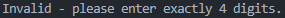

### **Comparing Player Guess to Secret Code**

The method used to compare the player's guess with the secret code involves iterating through the guess, and iterating through the generated code to check for two things.

Firstly, the numbers are compared specifically. For example, if the first character the player has entered in their guess, '1' for example, is an exact match to the generated code's first character '1'', the 'position' variable is increased.

The remaining characters in the user's guess are then iterated through, and any matching characters with an incorrect index position increase the value of the 'number', which lets the player know they got a number correct but it is not in the correct position in the generated code. The 'position' and 'number' variables are then returned to be used in the run_game() function.

#### **Player Guess Output**

The display_user_guess() function takes the player's guess, and converts each number into a string, which is then displayed to give the player a visual reminder of what they have guessed so far. Below this, they are told how many numbers are in the correct position, how many numbers they have correct which are in the wrong position, and how many attempts they have remaining.

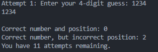

### **Game Graphics and Messages**

Depending on whether the player guessed the code right or wrong they will see a different graphic and message accordingly to their result of the game. Win or lose the player will be shown what the secret code was.

#### **You Win! Graphic and Message**

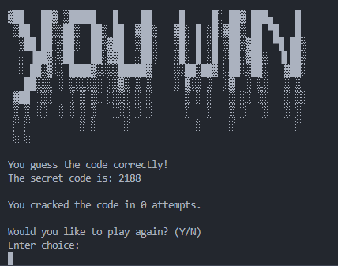

When the player wins the game, this "YOU WIN" graphic is displayed. The text was generated by [Text to ASCII Art](https://www.asciiart.eu/text-to-ascii-art)

The player is told they guessed the code correctly, they are also then told how many attempts it took them before asking them if they want to play again.

#### **Game Over Graphic and Message**

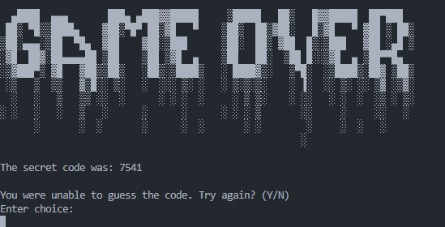

If the player cannot guess the code and runs out of attempts, a bloodied 'Game Over' graphic is displayed. Once again, the text was generated using [Text to ASCII Art](https://www.asciiart.eu/text-to-ascii-art), though the specific idea to use this style/font for the graphic is like i have mentioned before, this game was made during Halloween so to give it a spooky feeling i used the bloody text. The player is told what the secret code was before being asked if they would like to play again.

### **Play Again Function with Error Handling**

The start_game() function is named as such because it runs at the end of each instance of the game, whether the player wins or loses. However, it does also run at the end of the instructions page. It is a simple input function, similar to the one found in the main menu, which gives the player two options: Press 'Y' to play the game, press 'N' to return to the main menu. The wording is adjusted based on where the function is called so it makes sense in the flow of the game.

As with all other input functions in this game, error handling is used in the form of a ValueError for any key presses that are not 'Y' or 'N'. If the user enters 'y' or 'n', the upper() function is used to convert them to upper case to avoid any confusion. If any other characters are entered, such as numbers, special characters or other letters, the following error appears:

After the 'Game Over' screen and at the end of the instructions page:

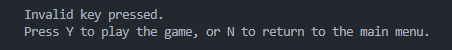

## **Considerations for Future Enhancements**

I have a lot of ideas that I would see implemented into this game if i had more time. Some of those ideas are reasonably simple, but others much more complex that would involve a great deal of time and consideration in order to implement them well.

### Difficulty Levels

One of the reasonably simple ideas i would like to implement is different difficulty levels. This being less attempts to crack the 4 digit secret code, a 5 or 6 digit secret code with the same amount of attempts, different amounts of how many numbers could be repeated etc.

### Improved UI

Obviously, in a command line application it is quite hard to add a lot of depth to UI but i do feel like if i had more time i could of made my program look a little better, with the introduction of colors, spacing out my text so it appears on different parts of the screen etc.

## **Testing**

A separate file has been created for information about testing. Please click the following link to access it: [**TESTING.md**](TESTING.md)

## **Deployment**

## **Credits**

### **Content**

- This project follows the Code Institute 'Love Sandwiches' code-along project, and although the type of project is very different from this one, it no doubt will show some similarity in how certain parts of the code are laid out.
- All ASCII images and text are all from the [ASCII official website](https://www.asciiart.eu/)

### **Acknowledgements**

- Richard Wells (mentor) - He went above and beyond and helped me massively by giving me ideas on what program to make and helping me to understand python.
- My family - They have motivated me and pushed me to keep going, even when i am struggling.
- My girlfriend - For constantly being supportive of me and giving me the time and space to complete this project.